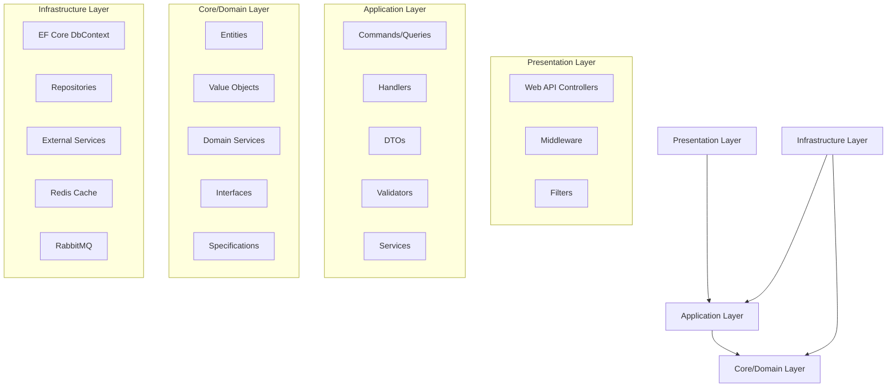

# Design Document

## Overview

Bu tasarım, .NET 9 C# kullanarak Clean Architecture prensiplerini takip eden, ölçeklenebilir ve sürdürülebilir bir alt yapı projesi oluşturmayı amaçlar. Proje, CQRS pattern, Repository pattern, Redis caching ve RabbitMQ message queue sistemlerini entegre eder.

## Architecture

### Katman Yapısı



### Proje Yapısı

```
CleanArchitecture.Solution/
├── src/
│   ├── CleanArchitecture.Domain/           # Core Layer
│   ├── CleanArchitecture.Application/      # Application Layer
│   ├── CleanArchitecture.Infrastructure/   # Infrastructure Layer
│   └── CleanArchitecture.WebAPI/          # Presentation Layer
├── tests/
│   ├── CleanArchitecture.Domain.Tests/
│   ├── CleanArchitecture.Application.Tests/
│   ├── CleanArchitecture.Infrastructure.Tests/
│   └── CleanArchitecture.WebAPI.Tests/
└── docker/
    ├── docker-compose.yml
    └── Dockerfile
```

## Components and Interfaces

### Core/Domain Layer

**Entities:**
- `BaseEntity<T>`: Tüm entity'ler için base class
- `AuditableEntity`: Audit trail özellikleri içeren base class
- Domain-specific entities (örnek: `User`, `Product`)

**Value Objects:**
- `Email`, `Money`, `Address` gibi value object'ler

**Domain Services:**
- Business logic'i içeren servisler
- Domain event'leri yöneten servisler

**Interfaces:**
```csharp
public interface IRepository<T> where T : BaseEntity
{
    Task<T> GetByIdAsync(int id);
    Task<IEnumerable<T>> GetAllAsync();
    Task<T> AddAsync(T entity);
    Task UpdateAsync(T entity);
    Task DeleteAsync(int id);
}

public interface IUnitOfWork
{
    Task<int> SaveChangesAsync();
    Task BeginTransactionAsync();
    Task CommitTransactionAsync();
    Task RollbackTransactionAsync();
}
```

### Application Layer

**CQRS Implementation:**
```csharp
// Commands
public record CreateUserCommand(string Name, string Email) : IRequest<int>;

public class CreateUserCommandHandler : IRequestHandler<CreateUserCommand, int>
{
    // Implementation
}

// Queries
public record GetUserQuery(int Id) : IRequest<UserDto>;

public class GetUserQueryHandler : IRequestHandler<GetUserQuery, UserDto>
{
    // Implementation
}
```

**Services:**
- `ICacheService`: Redis caching operations
- `IMessageQueueService`: RabbitMQ operations
- `IEmailService`: Email notifications

**DTOs ve Mapping:**
- AutoMapper profiles
- Request/Response DTOs

### Infrastructure Layer

**Data Access:**
```csharp
public class ApplicationDbContext : DbContext, IUnitOfWork
{
    public DbSet<User> Users { get; set; }
    
    protected override void OnModelCreating(ModelBuilder modelBuilder)
    {
        // Entity configurations
    }
}

public class Repository<T> : IRepository<T> where T : BaseEntity
{
    private readonly ApplicationDbContext _context;
    // Implementation
}
```

**Caching Service:**
```csharp
public class RedisCacheService : ICacheService
{
    private readonly IDistributedCache _cache;
    
    public async Task<T> GetAsync<T>(string key)
    {
        // Redis implementation
    }
    
    public async Task SetAsync<T>(string key, T value, TimeSpan expiration)
    {
        // Redis implementation
    }
}
```

**Message Queue Service:**
```csharp
public class RabbitMQService : IMessageQueueService
{
    private readonly IConnection _connection;
    
    public async Task PublishAsync<T>(T message, string queueName)
    {
        // RabbitMQ implementation
    }
    
    public async Task SubscribeAsync<T>(string queueName, Func<T, Task> handler)
    {
        // RabbitMQ consumer implementation
    }
}
```

### Presentation Layer

**Controllers:**
```csharp
[ApiController]
[Route("api/[controller]")]
public class UsersController : ControllerBase
{
    private readonly IMediator _mediator;
    
    [HttpGet("{id}")]
    public async Task<ActionResult<UserDto>> GetUser(int id)
    {
        var query = new GetUserQuery(id);
        var result = await _mediator.Send(query);
        return Ok(result);
    }
    
    [HttpPost]
    public async Task<ActionResult<int>> CreateUser(CreateUserCommand command)
    {
        var result = await _mediator.Send(command);
        return CreatedAtAction(nameof(GetUser), new { id = result }, result);
    }
}
```

**Middleware:**
- Exception handling middleware
- Logging middleware
- Correlation ID middleware

## Data Models

### Entity Framework Configurations

```csharp
public class UserConfiguration : IEntityTypeConfiguration<User>
{
    public void Configure(EntityTypeBuilder<User> builder)
    {
        builder.HasKey(x => x.Id);
        builder.Property(x => x.Name).IsRequired().HasMaxLength(100);
        builder.Property(x => x.Email).IsRequired().HasMaxLength(255);
        builder.HasIndex(x => x.Email).IsUnique();
    }
}
```

### Database Migration Strategy

- Code-First approach
- Automatic migrations in development
- Script-based migrations in production
- Seed data configuration

## Error Handling

### Global Exception Handling

```csharp
public class GlobalExceptionMiddleware
{
    public async Task InvokeAsync(HttpContext context, RequestDelegate next)
    {
        try
        {
            await next(context);
        }
        catch (Exception ex)
        {
            await HandleExceptionAsync(context, ex);
        }
    }
    
    private async Task HandleExceptionAsync(HttpContext context, Exception exception)
    {
        // Structured error response
        var response = exception switch
        {
            ValidationException => new { Status = 400, Message = "Validation failed" },
            NotFoundException => new { Status = 404, Message = "Resource not found" },
            _ => new { Status = 500, Message = "Internal server error" }
        };
        
        context.Response.StatusCode = response.Status;
        await context.Response.WriteAsync(JsonSerializer.Serialize(response));
    }
}
```

### Custom Exceptions

```csharp
public class DomainException : Exception
{
    public DomainException(string message) : base(message) { }
}

public class ValidationException : Exception
{
    public ValidationException(string message) : base(message) { }
}

public class NotFoundException : Exception
{
    public NotFoundException(string message) : base(message) { }
}
```

## Testing Strategy

### Unit Tests
- Domain layer: Entity business logic tests
- Application layer: Command/Query handler tests
- Infrastructure layer: Repository tests with in-memory database

### Integration Tests
- API endpoint tests
- Database integration tests
- Cache integration tests
- Message queue integration tests

### Test Configuration
```csharp
public class TestWebApplicationFactory<TStartup> : WebApplicationFactory<TStartup>
{
    protected override void ConfigureWebHost(IWebHostBuilder builder)
    {
        builder.ConfigureServices(services =>
        {
            // Replace real services with test doubles
            services.AddDbContext<ApplicationDbContext>(options =>
                options.UseInMemoryDatabase("TestDb"));
        });
    }
}
```

### Performance Testing
- Load testing with NBomber
- Database query performance monitoring
- Cache hit ratio monitoring
- Message queue throughput testing

## Configuration Management

### appsettings.json Structure
```json
{
  "ConnectionStrings": {
    "DefaultConnection": "Server=localhost;Database=CleanArchDB;Trusted_Connection=true;",
    "Redis": "localhost:6379"
  },
  "RabbitMQ": {
    "HostName": "localhost",
    "UserName": "guest",
    "Password": "guest",
    "Port": 5672
  },
  "Logging": {
    "LogLevel": {
      "Default": "Information",
      "Microsoft.AspNetCore": "Warning"
    }
  },
  "Cache": {
    "DefaultExpiration": "00:30:00"
  }
}
```

### Options Pattern Implementation
```csharp
public class RabbitMQOptions
{
    public string HostName { get; set; }
    public string UserName { get; set; }
    public string Password { get; set; }
    public int Port { get; set; }
}

public class CacheOptions
{
    public TimeSpan DefaultExpiration { get; set; }
}
```

## Security Considerations

### Authentication & Authorization
- JWT token-based authentication
- Role-based authorization
- API key authentication for external services

### Data Protection
- Sensitive data encryption
- Connection string encryption
- HTTPS enforcement

### Input Validation
- FluentValidation for request validation
- SQL injection prevention through EF Core
- XSS protection through proper encoding